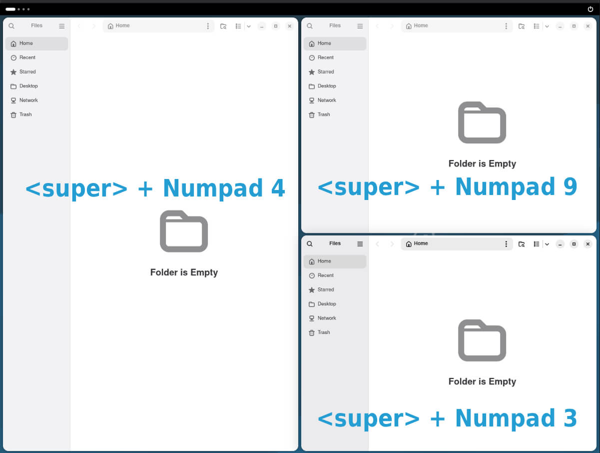
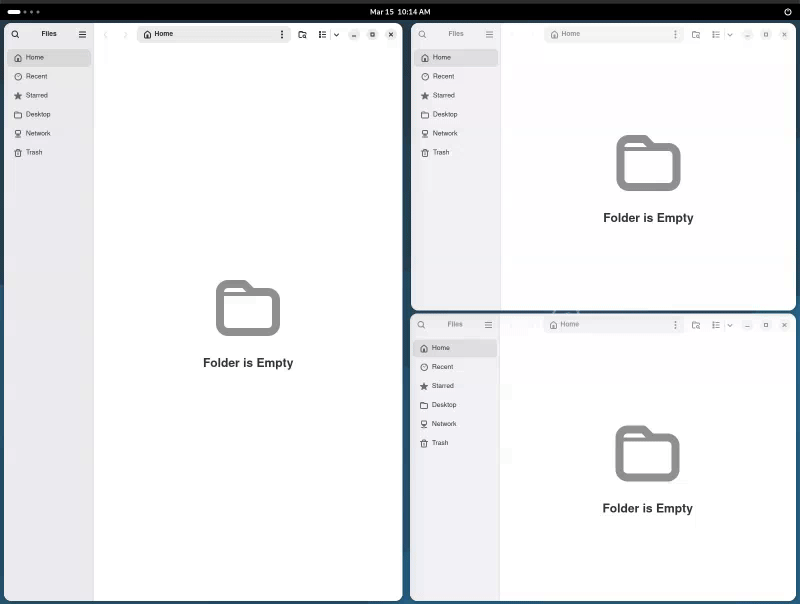

##  Awesome Tiles

Awesome Tiles is a tiling manager extension for GNOME Shell that makes it easy to move
windows around with precision. It does that with reconfigurable keyboard shortcuts
which are set to keys on the number pad by default.


## Usage

### Tiling Windows

The extension uses **Super + Number Pad** by default for quick tiling. Pressing the same shortcut multiple times cycles through different grid sizes (e.g., 50%, 75%, 33%).



### Linked Resize

Hold **Alt** (reconfigurable in settings) while dragging a window edge to resize all adjacent tiled windows at once.



## Features

- **Smart Tiling**: Tile windows in 9 different ways using the number pad.
- **Dynamic Grid Sizes**: Successive key presses cycle through different tiling sizes (e.g., 50%, 75%, 33%).
- **Linked Resizing**: Resize adjacent tiled windows simultaneously by holding a modifier key (**Alt** by default).
- **Customizable Gaps**: Add and adjust gaps around windows and between them to suit your preference.
- **Center Alignment**: Quickly align any window to the center of the workspace without resizing.
- **Fully Reconfigurable**: All keyboard shortcuts and tiling steps can be customized in the settings.
- **Workspace Navigation**: Integrated shortcuts for switching workspaces and moving windows between them.

### Default Keybindings

| Shortcut                | Action                      |
| ----------------------- | --------------------------- |
| **Super + KP_1**        | Tile window to Bottom Left  |
| **Super + KP_2**        | Tile window to Bottom       |
| **Super + KP_3**        | Tile window to Bottom Right |
| **Super + KP_4**        | Tile window to Left         |
| **Super + KP_5**        | Tile window to Center       |
| **Super + KP_6**        | Tile window to Right        |
| **Super + KP_7**        | Tile window to Top Left     |
| **Super + KP_8**        | Tile window to Top          |
| **Super + KP_9**        | Tile window to Top Right    |
| **Super + KP_0**        | Align window to Center      |
| **Super + KP_Add**      | Increase Gap Size           |
| **Super + KP_Subtract** | Decrease Gap Size           |
| **Alt + Resize**        | Trigger Linked Resize       |

## Installation

### From GNOME Extensions (Recommended)

1. Go to <https://extensions.gnome.org/extension/4702/awesome-tiles/>
2. Install and Enable.

### From source code

1.  **Clone the repository**:
    ```bash
    git clone https://github.com/velitasali/gnome-shell-extension-awesome-tiles.git
    ```
2.  **Navigate into the folder**:
    ```bash
    cd gnome-shell-extension-awesome-tiles
    ```
3.  **Run the local installation command**:
    ```bash
    ./install.sh local-install
    ```

## Credits

- [Useless Gaps](https://github.com/mipmip/gnome-shell-extensions-useless-gaps)
- [Night Theme Switcher](https://gitlab.com/rmnvgr/nightthemeswitcher-gnome-shell-extension)

## Contributing

### Translation

Create a copy of `po/awesome-tiles@velitasali.com.pot` in the **same directory** and name it
as follows:

- `<LANGUAGE_CODE>.po` for a language.
- `<LANGUAGE_CODE>_<COUNTRY_CODE>.po` for a language spoken in a specific region.

Examples:

- `ja.po` for the Japanese language translation.
- `de_AU.po` for the German language spoken in Austria.

Finally, open a new pull request that includes your translation.
